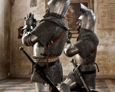

# Savage Worlds Adventure Dec Generator
This project generates a Savage Worlds adventure deck based on an oppinionated structure:

- a directory where the card template is located
- a directory where the images to apply on top of the template are located
- a directory where text files for each card are located
- a directory where the resulting cards will be generated

## Strong considerations
1. There should be as many images as text files, otherwise the process will finish with error at the moment there is no correspondence.
2. Text files must be named after the image that matches in a card. _I.e. images/001.png matches texts/001.txt_
3. A text file has this structure:
```properties
header=Por Crom
title=Que los dioses te oigan
body=Juega estar carta para aumentar en un +2 la próxima tirada de rasgo
```
4. All images must be PNG
5. If the texts you use contain special characters (i.e. accents), consider using a font accepting them, otherwise they won't be displayed in the card.
6. The dimensions of a card are: `243 x 340 px`, so this project uses templates with those dimensions.
7. The images for each card must be `196 x 157 px`, so that they fit in the template.
8. Header and Title are always Uppercase, no matter how you write them down in the text files.

## How to generate a deck
1. Create the following file structure:

```
+ deck
|
+---- images
|       |
|       +---- 001.png
        ...
|       +---- 053.png
|
+---- outputs
+---- templates
|       |
|       +---- fantasy.png
|       |
|       +---- sci-fi.png
|
+---- texts
        |
        +---- 001.txt
        ...
        +---- 053.txt
```
2. Download the binary for your OS platform (Linux, OSX, Windows) from releases
3. From the location you downloaded the binary, run the tool, it will ask you some questions:
    - the location of the root directory (it will use as base for the next ones)
    - the location of the images directory
    - the location of the templates directory. You will be prompted to choose one template
    - the location of the texts directory
    - the font to use for the Header of the card
    - the font to use for the Title and the Body of the card (both will share font)
4. The generation will proceed and the outputs dir will be populated with your card!

## Examples

There is a very simple example in this repository, at the [examples](./examples) directory.

#### Template Example


#### Image Example


#### Text Example
```properties
header=Por Crom
title=Que los dioses te oigan
body=Juega estar carta para aumentar en un +2 la próxima tirada de rasgo
```

#### Card Example

